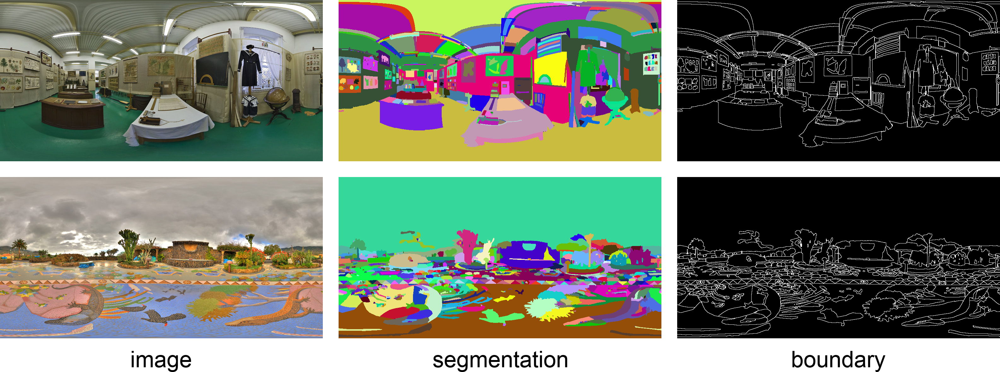

# Spherical Superpixel
This repository contains the dataset, the evaluation code and the source code of our works on spherical superpixels.

## Dataset
Currently, our dataset contains 75 manually annotated spherical panoramas. The original panoramas are selected from [SUN360](https://vision.princeton.edu/projects/2012/SUN360/data/) dataset. Each image is resized to 1024x512 pixels and segmented with an annotation tool based on the application provided by the authors of [BSD](https://www2.eecs.berkeley.edu/Research/Projects/CS/vision/bsds/) dataset.

For each spherical panorama, we provide the ground truth segmentations and ground truth boundaries. Some annotation examples are shown below. Our dataset can be downloaded at [SPSDataset75](http://scs.tju.edu.cn/~lwan/data/spsdataset/spsdataset75.rar). If you use this dataset in published work, please cite our paper as
```
@InProceedings{SPSDataset75,
    author   = {Liang Wan and Xiaorui Xu and Qiang Zhao and Wei Feng},
    title    = {Spherical Superpixels: Benchmark and Evaluation},
    booktitle  = {ACCV},
    YEAR   = {2018},
}
```



## Code
Currently, there is only the executable for spherical SLIC algorithm. If you use it in your work, please cite our paper as 
```
@ARTICLE{SLICSTMM, 
    author = {Q. {Zhao} and F. {Dai} and Y. {Ma} and L. {Wan} and J. {Zhang} and Y. {Zhang}}, 
    journal = {IEEE Transactions on Multimedia}, 
    title = {Spherical Superpixel Segmentation}, 
    year = {2018}, 
    volume = {20}, 
    number = {6}, 
    pages = {1406-1417},
}
```